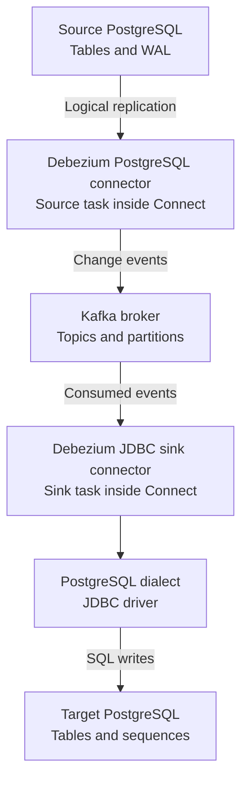

# Debezium architecture: from reader to writer

If you know the reader → Kafka → writer model from pgstream, you already know
the overall shape of this pipeline. Debezium adds an important runtime boundary:
Kafka Connect runs the source and sink connector plugins.

This guide describes this lab's Kafka Connect deployment. It is background for
[dbz#2661](https://github.com/debezium/dbz/issues/2661), not an implementation of
the proposed feature.

## 1. The deployment in this lab



The source and sink boxes are separate responsibilities. In this lab, both run
inside the **same `connect` container**. Kafka runs in its own `kafka` container;
the databases run in `source` and `target`.

Production deployments can put source and sink connectors in separate Connect
clusters for independent operation. Neither connector runs inside the Kafka
broker. See the [Compose configuration](docker-compose.yml) for this lab's actual
service boundaries.

## 2. Worker, connector, and task

**Worker:** a running Kafka Connect process. It loads connector plugins and
manages their execution.

**Connector:** a configured integration, such as “capture this PostgreSQL
database” or “write these topics into this target.” Installing a plugin makes
its implementation available; registering a configuration creates an instance.

**Task:** the execution unit that does the reading or writing. The connector
supplies task configurations, and Connect runs the tasks on workers.

In distributed mode, Connect can reassign tasks when workers join or leave.
This is a **rebalance**. A task can therefore stop during routine operations;
stopping does not mean a database migration has reached cutover.

`tasks.max` is a ceiling, not a promise that every connector can parallelize all
of its work. Task concurrency depends on the connector and available work.

Reference: [Kafka Connect overview](https://kafka.apache.org/41/kafka-connect/overview/).

## 3. What the reader owns

The PostgreSQL source connector understands the source database's change stream.
PostgreSQL exposes WAL changes through logical decoding; `pgoutput` is its
built-in logical decoding output plugin.

A **publication** selects the tables published through `pgoutput`. A
**replication slot** tracks replication consumption and supports retention of
the WAL the consumer still needs.

The connector converts decoded row changes into Debezium events. Its source
position includes WAL progress, allowing capture to resume after a restart.

An initial snapshot can capture existing rows before streaming later changes.
This lab instead restores the initial data using `pg_dump` and configures
`snapshot.mode=no_data` so the connector does not copy those rows again.

Reference: [PostgreSQL connector documentation](https://debezium.io/documentation/reference/stable/connectors/postgresql.html).

## 4. Follow one insert

The source application runs:

```sql
INSERT INTO lab.events (payload)
VALUES ('hello');
```

PostgreSQL evaluates the default and generates `id=1001`. The source connector
observes the resulting row change and constructs an event like this:

```json
{
  "before": null,
  "after": {
    "id": 1001,
    "payload": "hello"
  },
  "op": "c",
  "source": {
    "schema": "lab",
    "table": "events"
  }
}
```

This is a shortened illustration. Actual records include more metadata and,
with this lab's JSON converter settings, a schema/payload wrapper. The record
key is separate from the value shown here.

`after` contains the new row state. `op=c` identifies a create event. The source
metadata describes where the change originated.

The event carries the generated ID. It does not instruct the target to execute
the source column's default expression.

## 5. Connect, converters, and Kafka

The source task produces structured Connect records. Connect's **converters**
serialize their keys and values into Kafka bytes. On the sink side, converters
deserialize those bytes back into records.

This lab uses `JsonConverter` with schemas enabled for both keys and values.
Serialization settings are part of the worker configuration in
[docker-compose.yml](docker-compose.yml).

Optional **single message transformations**, or SMTs, modify individual records.
Examples include routing topics and extracting fields. They are distinct from
the connector's database capture or write logic.

Kafka stores events in topic partitions. Source capture and target application
can progress independently: a temporary sink slowdown does not require the
source connector to stop immediately.

References: [Kafka Connect overview](https://kafka.apache.org/41/kafka-connect/overview/)
and [Debezium architecture](https://debezium.io/documentation/reference/stable/architecture.html).

## 6. What the writer owns

The Debezium JDBC sink understands Debezium change events directly, so it does
not require an SMT to flatten the envelope first.

The sink maps record fields to target columns and executes database writes.
Its database **dialect** supplies database-specific behavior, including SQL
generation. The **JDBC driver** communicates with the target database.

In this lab, the sink uses upserts. Conceptually, the resulting SQL is:

```sql
INSERT INTO lab.events (id, payload)
VALUES (1001, 'hello')
ON CONFLICT (id)
DO UPDATE SET payload = EXCLUDED.payload;
```

The target receives `id=1001` explicitly. Its `DEFAULT nextval(...)` therefore
does not execute, and its sequence stays where it was.

Reference: [JDBC sink documentation](https://debezium.io/documentation/reference/stable/connectors/jdbc.html).

## 7. Two progress positions

**Source progress:** how far capture has advanced through PostgreSQL's change
stream. The source connector attaches source-position information to records;
Connect persists source offsets for recovery.

**Sink progress:** how far consumption has advanced through each Kafka topic
partition. These are Kafka consumer offsets, not PostgreSQL WAL positions.

The lab's `OFFSET_STORAGE_TOPIC` configures Connect's source offset storage.
It should not be confused with the sink consumer group's committed offsets.

The JDBC sink provides at-least-once delivery. For example:

1. A target database write succeeds.
2. The process fails before the corresponding Kafka consumer offset is committed.
3. On restart, the record can be delivered again.

Upsert semantics help repeated row writes converge. Any extra side effect we
add—such as advancing a sequence—also needs safe retry behavior.

References: [Kafka Connect overview](https://kafka.apache.org/41/kafka-connect/overview/),
[PostgreSQL recovery behavior](https://debezium.io/documentation/reference/stable/connectors/postgresql.html),
and [JDBC delivery guarantees](https://debezium.io/documentation/reference/stable/connectors/jdbc.html).

## 8. Where dbz#2661 fits

The experiment ends with the target's maximum row ID at **1,500**, but its
sequence at **1,000**. The first default-generated target insert tries **1,001**
and collides. See [the captured results](RESULTS.md).

The proposed capability belongs in the JDBC sink's PostgreSQL behavior:

```text
Receive records
    ↓
Resolve target tables and columns
    ↓
Write a batch successfully
    ↓
Advance supported target sequences
    ↓
Report successful processing
```

This is a conceptual flow, not a verified call graph. The exact transaction,
flush, and acknowledgment boundaries require a code walkthrough.

The [maintainer's response](https://github.com/debezium/dbz/issues/2661#issuecomment-5723777321)
sets the intended scope:

- A PostgreSQL option, disabled by default.
- Identity columns and direct `nextval(sequence)` defaults.
- Ascending, non-cycling sequences.
- Advance only; never rewind.
- Catalog-based discovery.
- Skip derived defaults such as `nextval(seq) + 100` with a one-time warning.
- A target that stays read-only to applications until cutover.

Our deliberately **unowned sequence** is an important discovery case. We must
not assume a helper for owned serial/identity sequences covers it.

The implementation must also establish safe coordination between tasks and
safe behavior on retries. The maintainer's suggested locking SQL is a design
starting point that still needs validation against the actual connection and
transaction lifecycle.

This would advance target generators using observed row values. It would not
replicate the source sequence's exact state or provide a complete cutover
orchestration system.

## 9. Other Debezium deployment forms

**Debezium Engine** embeds change capture as a library in a Java application.

**Debezium Server** is a configurable application that sends captured changes
to supported destinations.

These are alternatives to running capture through Kafka Connect. This lab uses
Connect, so its worker/task lifecycle is the relevant one for our investigation.

Reference: [Debezium deployment alternatives](https://debezium.io/documentation/reference/stable/architecture.html).

## 10. Next code walkthrough

Follow one JDBC sink batch through these questions:

1. Where does the sink task receive records from Connect?
2. How are records grouped and buffered for target tables?
3. Where is target column metadata discovered and cached?
4. How is the PostgreSQL dialect selected?
5. Where are statements executed and transactions committed?
6. How does successful flushing permit consumer progress to be committed?
7. Where can sequence advancement participate safely?

Read [HOW_IT_WORKS.md](HOW_IT_WORKS.md) next for the lab's concrete sequence
failure and manual cutover repair.
